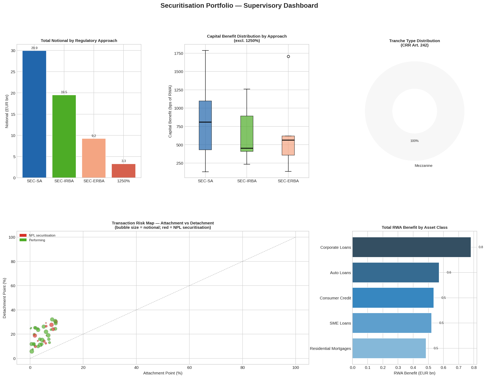

# SUP-Data-Analysis

Python scripts for data analysis and visualisation in the supervisory context

## Scripts

### `securitisation_analysis.py`
Simulates a hypothetical portfolio of securitisation transactions and produces a 
supervisory dashboard covering:
- Tranche classification by seniority (CRR Art. 242)
- Capital benefit calculation pre- and post-securitisation (CRR Arts. 259–264)
- NPL securitisation flagging (EBA guidelines)
- RWA relief by regulatory approach (SEC-SA / SEC-IRBA / SEC-ERBA / 1250%)

**Libraries:** `pandas`, `numpy`, `matplotlib`, `seaborn`

## Output

